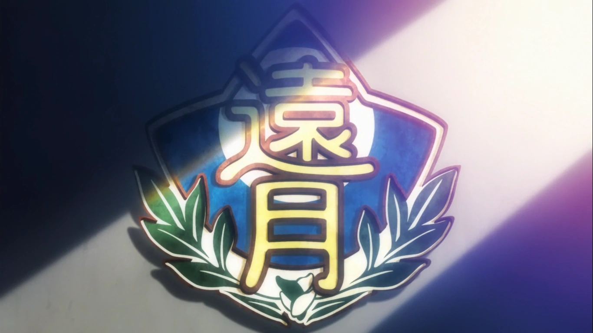

# Bienvenue à l'Academie Tôtsuki



> *“Si vous n'êtes pas prêts à tout risquer, alors vous ne méritez pas de cuisiner.”* - Un dicton populaire à l'Académie Tôtsuki.

## 🍱 Introduction

Tôtsuki est un site dédiée à l'univers culinaire, inspirée de la célèbre série **Food Wars** (Shokugeki no Soma). Sur ce site, les utilisateurs peuvent découvrir l'académie, ses professeurs, élèves et bien sûr, les incroyables recettes qui sont partagées.

## 🚀 Caractéristiques

- **Présentation de l'Académie**: Une introduction complète à l'académie et son histoire.
- **Professeurs et Élèves**: Découvrez les profils de certains des meilleurs chefs du monde.
- **Recettes**: Plongez-vous dans des recettes détaillées inspirées de la série.
- **Forum**: Un espace pour la communauté pour discuter et partager des idées culinaires.
- **Événements IRL**: Restez à jour avec les événements et rencontres organisés par l'académie.
- **Multilingue**: Accédez au site dans de nombreuses langues, dont le français, l'anglais, le japonais, et bien d'autres!

## 🛠 Technologies utilisées

- **Front-end**: HTML, Tailwind CSS.
- **Back-end**: PHP, Symfony.
- **Base de données**: MysSQL.

## 💼 Installation et configuration

1. **Clonez le projet**
   ```bash
   git clone [[lien_du_dépôt]](https://github.com/teikaro/Totsuki)
   cd Totsuki

    Installez les dépendances
    composer install et ensuite composer update

    Exécutez le projet
    une fois dans le dossier Totsuki, faire la commande : **symfony:serve**

## 📝 Licence

- **Ce projet est sous licence MIT.**

## 🤝 Contributions

Les contributions, corrections linguistiques, problèmes et demandes de fonctionnalités sont les bienvenues!
